# Machine Tproot

**Plataforma:** DockerLabs  

**Dificultad:** Muy fácil

**Sistema Operativo:** Linux 

Tproot es una máquina bastante simple de resolver; sin embargo, nos permitirá aprender diversas técnicas y conceptos de seguridad ofensiva. En la resolución de esta máquina aprenderemos:

- Escaneo de puertos abiertos, servicios y versiones.
- Identificación de versiones vulnerables de servicios.
- Uso básico de la herramienta Metasploit.

## Preparación del entorno de trabajo (Si ya lo tienes, ve a la sección de enumeración)

Al ser una máquina de Docker Labs, debemos asegurarnos de tener docker instalado y activo en nuestra máquina, en mi caso Parrot. Posteriormente, descargamos la máquina de la página oficial de DockerLabs. Obtenemos un archivo zip, lo descomprimimos.

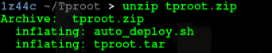

Luego ejecutamos el script *auto_deploy.sh*, de la siguiente manera.

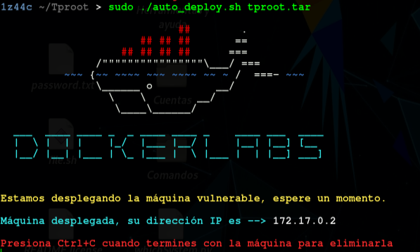

## 1. Enumeración

Verifiquemos la conectividad con el objetivo para confirmar la correcta ejecución del script.

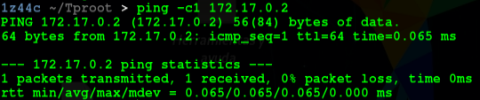

Luego de comprobar conectividad, se realiza un escaneo de puertos abiertos con nmap, con el siguiente comando:

```bash
nmap -p- -sS --open --min-rate 4000 -n -Pn 172.17.0.2
```

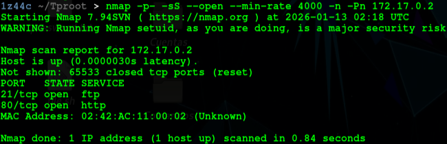

Comprobemos servicios y versiones con otro escaneo:

```bash
nmap -p21,80 -sVC -vv 172.17.0.2
```

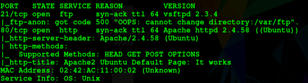

En este punto podríamos intentar revisar el servidor http.

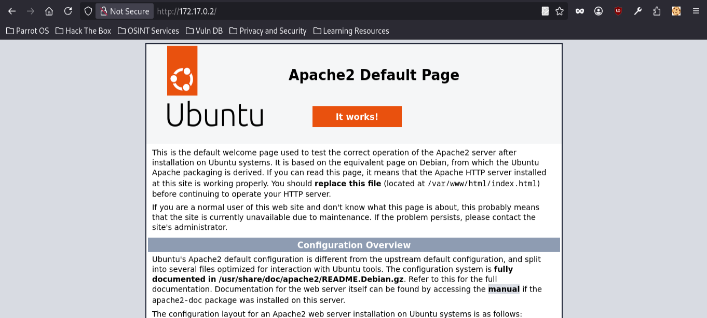

Incluso se realizó un fuzzing de directorios, pero no se encontró nada interesante. Por lo tanto, se realizó un escaneo adicional con nmap para verificar vulnerabilidades.

```bash
nmap -p21,80 --script vuln -vv 172.17.0.2
```

Obteniendo el siguiente resultado:

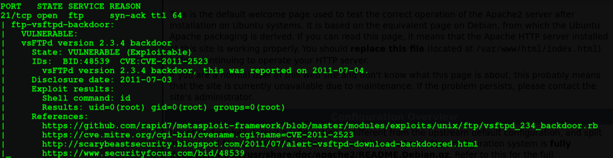

Por lo que se puede observar la versión del servicio FTP es vulnerable.

## 2 Explotación

Iniciemos la consola de Metasploit.

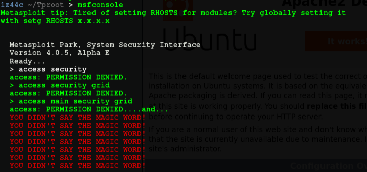

Busquemos por la versión del servicio ftp:

```bash
search vsftpd 2.3.4
```

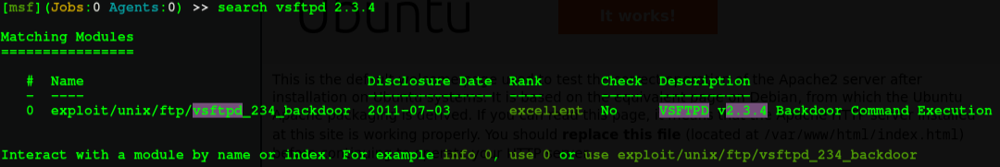

Seleccionamos el exploit mostrado, lo dejamos con el payload configurado por defecto.

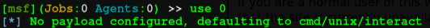

Luego observamos las opciones.

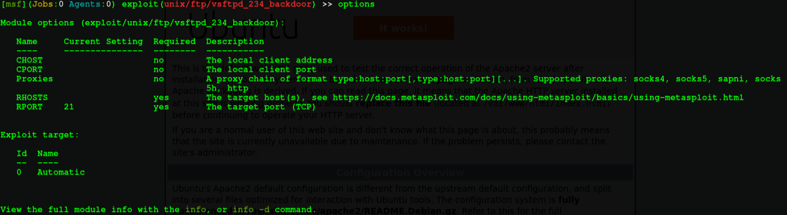

Solo el campo *RHOSTS* es obligatorio para ejecutar el exploit, se configura a continuación.

```bash
set rhosts 172.17.0.2
```

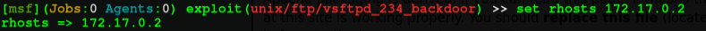

Por último ejecutamos el script con el comando *run* o *exploit* y obtenemos acceso al sistema objetivo con el usuario root (por lo que no fue necesario escalar privilegios).

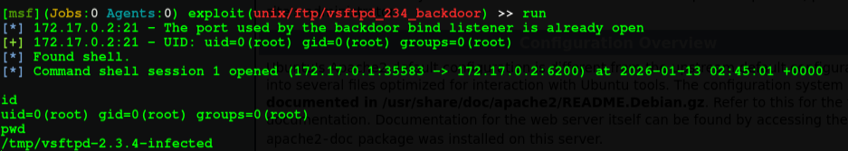

## 3 Conclusión

En conclusión, la máquina Tproot es un reto estupendo para principiantes en la seguridad ofensiva, debido a que el reto permite identificar versiones vulnerables de servicios y explotarlas de manera automatizada con la herramienta Metasploit.