# Machine Dragon

**Plataforma:** Tre Hackers Labs
**Dificultad:** Principiante
**Sistema Operativo:** Linux

La máquina Dragon de la plataforma The Hackers Labs es una máquina bastante sencilla la cual nos permite aprender y aplicar conceptos de seguridad ofensiva como:
- Escaneo de puertos y servicios
- Fuzzing de directorios
- Ataques de fuerza bruta

## 1. Enumeración

Primero verificamos conectividad con la máquina objetivo para comprobar una buena configuración de red.

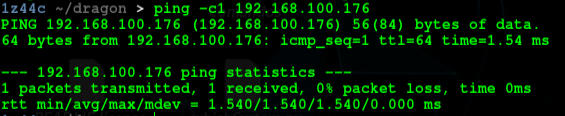

Luego de comprobar conectividad con el objetivo, se realiza un escaneo de puertos abiertos con nmap, haciendo uso del siguiente comando.

```bash
nmap -p- -sS --open --min-rate 4000 -n -Pn 192.168.100.176
```

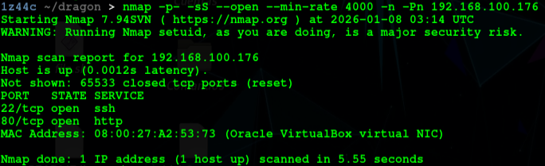

Como podemos observar los puertos 22,80 están abiertos, realicemos un escaneo de versiones con el siguiente comando:

```bash
nmap -p22,80 -sVC -vv 192.168.100.176
```

Obteniendo los siguientes resultados, nada interesante de momento.

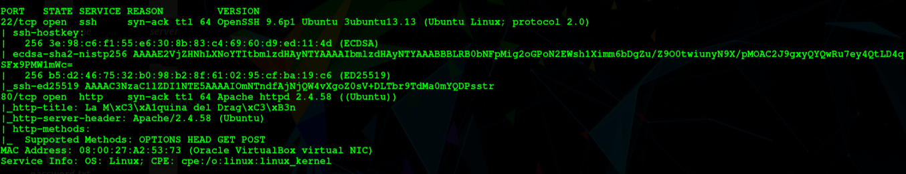

Bien, ahora sabemos que existe un servidor http en el puerto 80, veamos que contiene.

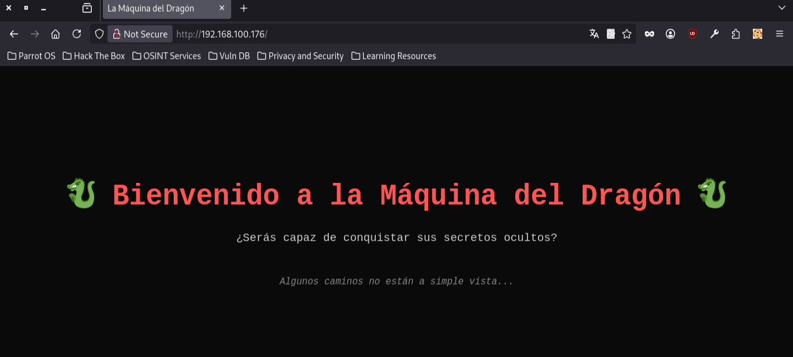

Una web común y corriente, siempre es recomendable revisar el código fuente de una página web, sin embargo no encontré nada interesante allí. Mejor realicemos un fuzzing de directorios con gobuster. Usando el siguiente comando.

```bash
gobuster dir -w /usr/share/wordlists/dirbuster/directory-list-2.3-medium.txt -u http://192.168.100.176/ -t 100 -x txt,html,php
```

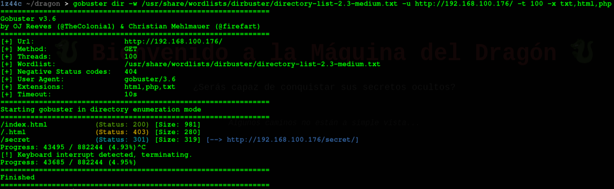

Encontramos un directorio llamado secret, parece comprometedor, veamos que contiene.

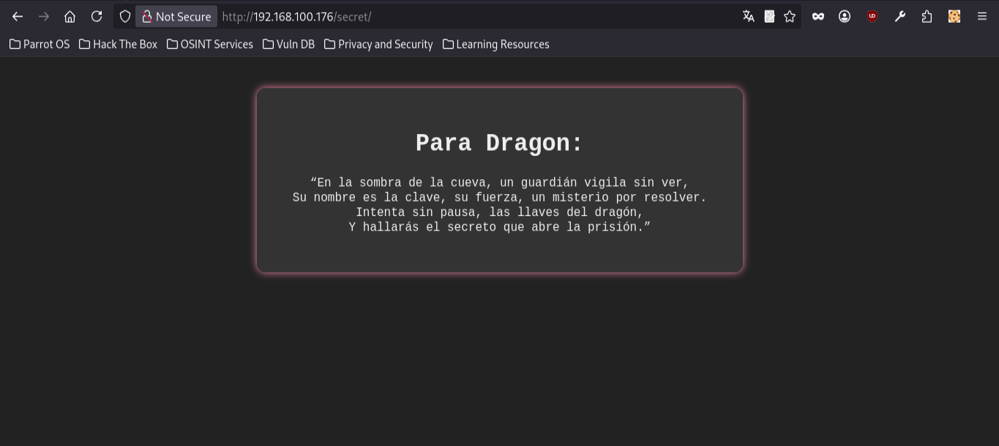

Se encuentra una especie de acertijo, sin embargo en la parte superior menciona 'Para Dragon' por lo que encontramos un posible nombre de usuario.

## 2 Explotación

Utilizando el nombre de usuario se puede intentar un ataque de fuerza bruta con hydra, con el siguiente comando.

```bash
hydra -l dragon -P /usr/share/wordlists/rockyou.txt -t 64 ssh://192.168.100.176
```

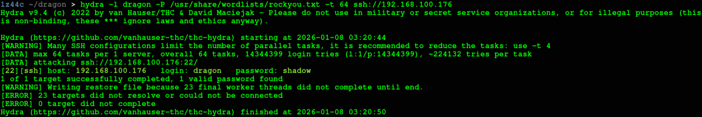

Y se encuentra la contaseña de el usuario dragon, por lo que nos conectamos por ssh y obtenemos el primer acceso al sistema objetivo.

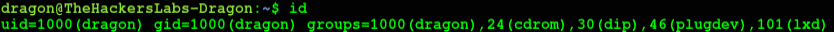


## 3 Escalada de privilegios

Luego de entrar al sistema a través del usuario dragon, una de las primeras cosas que se debe hacer es ejecutar el comando:

```bash
sudo -l
```

De esta manera verificamos si el usuario en el que estamos puede correr el comando sudo, con que comandos y para que usuarios, en este caso observamos lo siguiente.

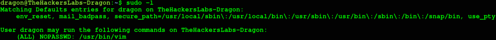

Y notamos que el usuario puede ejecutar sudo con el comando vim, buscamos el comando en GTFobins y encontramos lo siguiente.

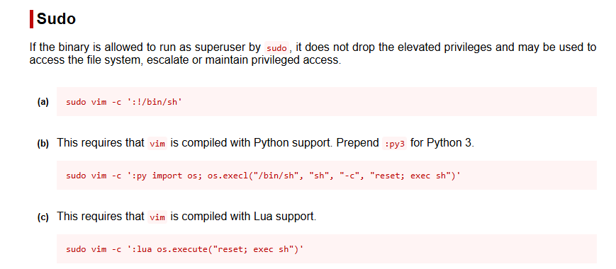

Y abusamos de esta configuración con la opción a. Obteniendo acceso al usuario root.

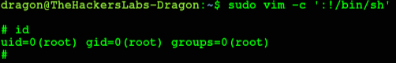

## 4 Conclusión

La máquina Dragon es un reto bastante simple, pero muy útil para aplicar conceptos básicos de hacking, es recomendable realizar la máquina una segunda vez pero sin el write-up para ir comprendiendo una metodología de ataque simple.