# Machine Inj3ctCrew

**Plataforma:** The Hackers Labs

**Dificultad:** Principiante

**Sistema Operativo:** Linux 

La máquina Inj3ctCrew es un reto muy divertido y que nos permitirá aprender varios conceptos de seguridad ofensiva como: 
- Enumeración de puertos abiertos, servicios y versiones.
- Fuzzing de directorios.
- Análisis de código fuente de una página web.
- Identificación y decodificación de cadenas de texto en base 64.
- Cracking de contraseñas con hashcat.
- Ejecución remota de comandos (RCE).
- Ataques de fuerza bruta con hydra.

## 1. Enumeración

Primero verificamos una correcta configuración de red, probando conectividad con el objetivo.

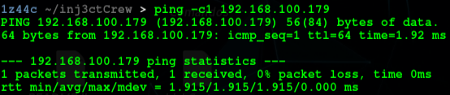

Luego de una prueba exitosa de conectividad, se realiza un escaneo de puertos abiertos con nmap.

```bash
nmap -p- -sS --open --min-rate 4000 -n -Pn 192.168.100.179
```

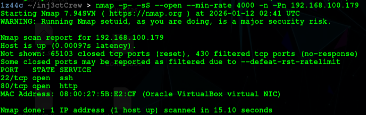

Notamos que existen dos puertos abiertos, verifiquemos versiones con otro escaneo.

```bash
nmap -p22,80 -sVC -vv 192.168.100.179
```

Obteniendo los siguientes resultados:

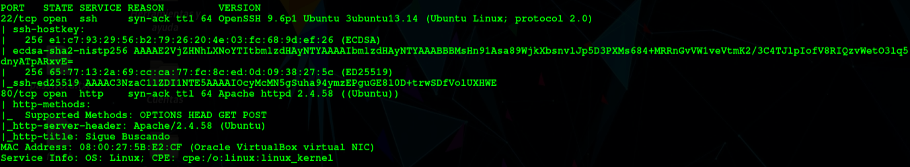

Veamos qué contiene el servidor http.

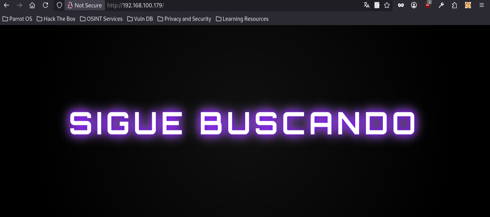

En una página web siempre es recomendable revisar el código fuente de la misma, veamos qué contiene.


Encontramos una especie de cadena de texto, la cual podemos identificar como codificación base 64, porque la cadena termina en un '='. 

Podemos decodificar la cadena esperando alguna información interesante. 

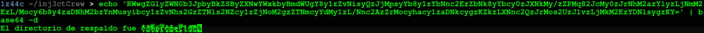

Aquí se menciona que el directorio de respaldo fue comprometido. Realicemos un fuzzing de directorios a ver qué encontramos.

```bash
gobuster dir -w /usr/share/wordlists/dirbuster/directory-list-2.3-medium.txt -u http://192.168.100.179/ -t 100 -x php,html,txt
```

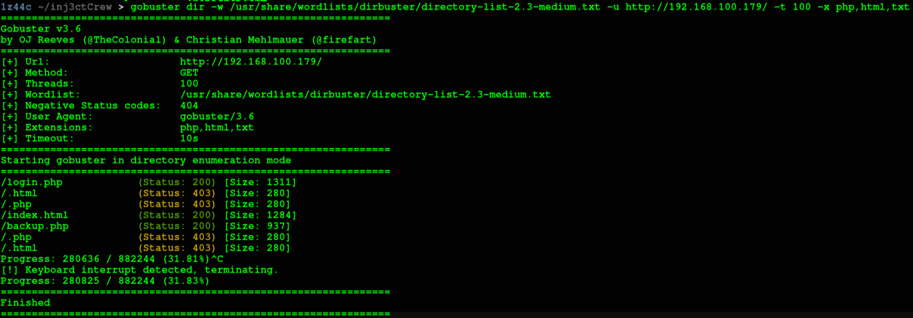

Encontramos dos resultados interesantes: login.php y backup.php. Sin embargo vamos a revisar backup.php debido a que anteriormente se mencionó que el respaldo se encuentra comprometido.

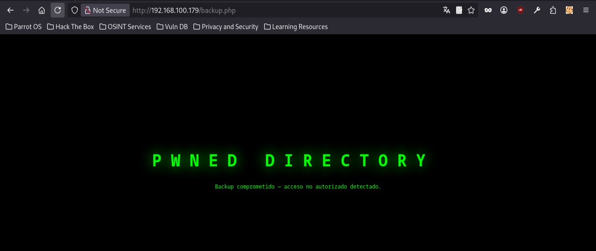

Aquí se nos indica que el backup se encuentra comprometido, pero nada más. Nuevamente revisemos su código fuente.

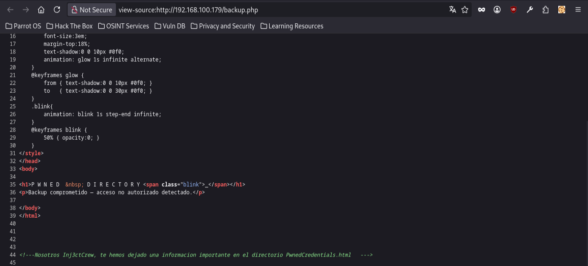

Nos menciona que en PwnedCredentials.html se encuentra una 'información importante', por lo que debemos revisarla obligatoriamente.

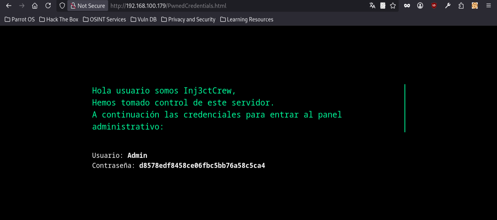

Encontramos credenciales de acceso al panel de login.php encontrado anteriormente. El usuario es Admin, sin embargo la contraseña parece estar hasheada, voy a guardar el hash en un archivo llamado hash.txt, en internet busqué por un identificador de hashes. Voy a utilizar el siguiente: https://hashes.com/en/tools/hash_identifier

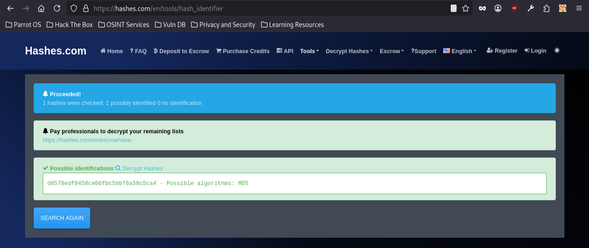

Aquí se nos revela que el algoritmo utilizado para este hash es MD5. Utilicemos hashcat para romper la contraseña.

```bash
hashcat -m 0 -a 0 hash.txt /usr/share/wordlists/rockyou.txt
```

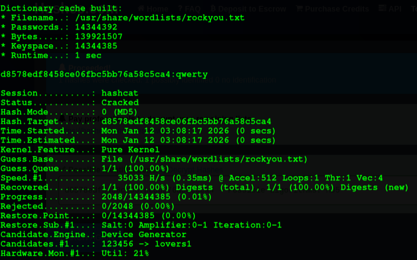

Hemos logrado romper la contraseña, ingresemos en login.php con las credenciales.

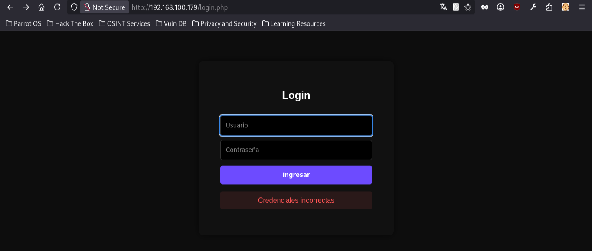

Luego de ingresar las credenciales encontramos un panel de ejecución remota de comandos, es bastante limitada, por lo que no me permitió enviarme una shell reversa a mi parrot, sin embargo, lo que se me ocurrió, es visualizar el contenido del archivo /etc/passwd.

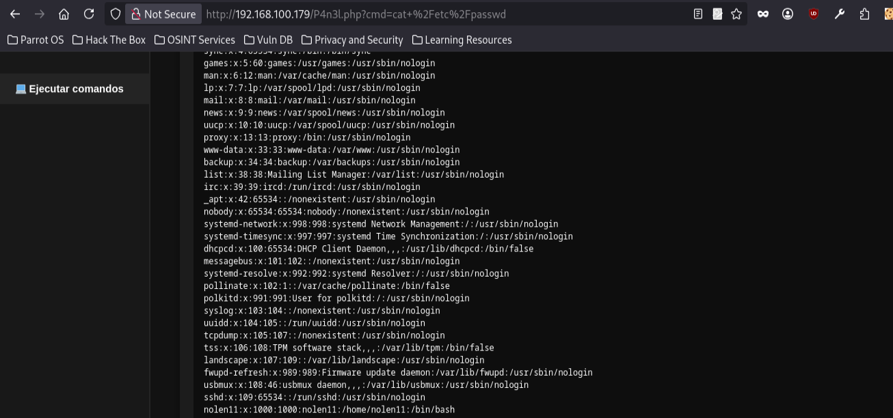

## 2 Explotación

Encontramos un usuario llamado nolen11, por lo que podemos realizar un ataque de fuerza bruta con hydra, de la siguiente manera.

```bash
hydra -l nolen11 -P /usr/share/wordlists/rockyou.txt -t 64 ssh://192.168.100.179
```

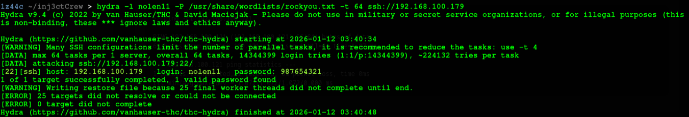

Encontramos la contraseña de usuario por lo que nos conectamos al usuario nolen11 a través de ssh. Obteniendo el primer acceso al sistema objetivo.

## 3 Escalada de privilegios

Ejecutamos sudo -l para verificar posibles privilegios sudo del usuario nolen11.

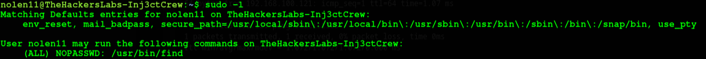

Nos encontramos con que el usuario nolen11 puede correr sudo con el comando: find. Revisemos en GTFObins. https://gtfobins.github.io/

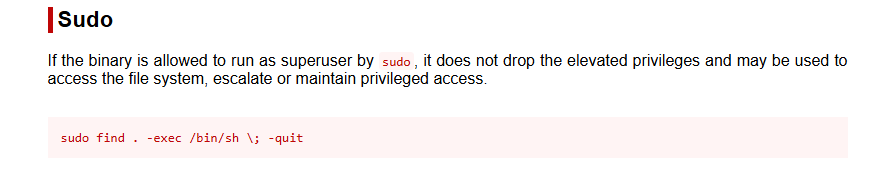

Solo debemos abusar de este privilegio como nos muestra GTFObins y obtenemos acceso al usuario root.

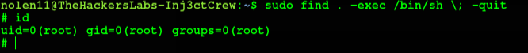
 
 ## 4 Conclusión

La máquina Inj3ctCrew es un reto ideal para empezar y prácticar, ya que permite reforzar conceptos fundamentales de seguridad ofensiva como la enumeración de servicios, el análisis de código fuente, la identificación de credenciales expuestas y el uso de herramientas de cracking y fuerza bruta. Además, introduce de manera clara la importancia de revisar privilegios sudo para lograr la escalada de privilegios. En conjunto, la máquina ofrece una experiencia práctica y progresiva que simula escenarios reales de compromiso de sistemas Linux.