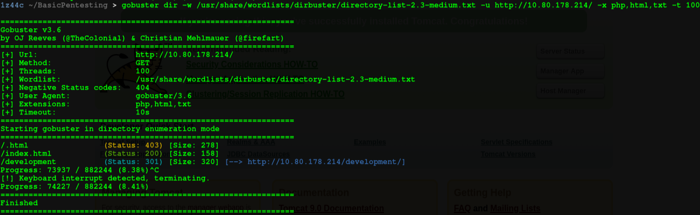
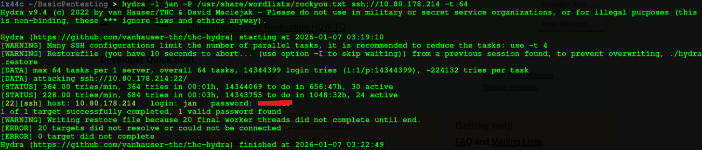

# Machine Basic Pentesting

**Plataforma:** TryHackMe  
**Dificultad:** Easy  
**Sistema Operativo:** Linux  

Este es mi primer Write-up, espero les sirva. La máquina Basic Pentesting es un reto sencillo pero que nos dará un poco de trabajo, nos permitirá aplicar algunos conceptos básicos como:
- Escaneo de puertos
- Fuzzing
- Enumeración en Linux
- Ataques de fuerza bruta
- Cracking de contraseñas

IP: 10.80.178.214

## 1. Enumeración

Primero se verifica conectividad con el objetivo para verificar una correcta conexión a la VPN:

Posterior a esto realizamos un escaneo de puertos abiertos con nmap.

Podemos observar algunos puertos abiertos, los cuales verificaremos sus versiones y servicios con otro escaneo.

Por los resultados del anterior escaneo se observa que tenemos los servicios ssh, http, samba.

Podríamos observar el servidor web que se encuentra en el puerto 80, sin embargo no encontramos nada interesante. Por lo que vamos a realizar un fuzzing de directorios.

Encontramos un directorio llamado development, veamos que contiene:

Al revisar ambos archivos notamos que en el archivo j.txt existe información interesante.

En este archivo se nos revela que un usuario cuya inicial es la 'J' podría tener una contraseña débil, posible vector de ataque de fuerza bruta.

Hemos visto que el objetivo corre el servicio samba, por lo que podemos utilizar una herramienta llamada enum4linux. Pero primero debemos buscarla y copiarla de Github.

Y clonamos el repositorio.

Luego de darle permisos para ejecución y ejecutarlo hacia el objetivo, obtenemos nombres de usuario.

## 2 Explotación

Ahora sabemos que el usuario cuya inicial es 'J' es jan, por lo que podemos lanzar un ataque de fuerza bruta con Hydra.

Obtenemos la contraseña del usuario jan y procedemos a conectarnos por ssh. Obteniendo el primer acceso al sistema.

## 3 Escalada de privilegios

Ahora, para escalar privilegios es recomendable utilizar la herramienta linpeas.sh, de igual manera disponible en Github. Este script debemos pasarlo a la máquina objetivo, por lo que levantamos un servidor http por el puerto 8080.

Y en la máquina objetivo lo descargamos por medio de wget. Esto en el directorio /tmp ya que en otros directorios no me permitía descargarlo por los permisos del usuario jan.

Luego le asignamos permisos de ejecución y corremos el script.

Donde encontramos algo interesante, en el directorio .ssh dentro del usuario kay, se encuentra un id_rsa.

Podemos copiar su contenido a nuestra máquina, como se muestra a continuación.

y copiamos su contenido en el archivo creado.

Luego es muy importante dejarlo con permisos 600. Sin embargo observamos que nos solicita una pass-key.

Por lo que debemos utilizar la herramienta John The Ripper, primero pasamos el archivo id_rsa a john con el siguiente comando.

Ahora si podemos crackear la passphrase del archivo id_rsa con john.

Ya con la passphrase podemos conectarnos mediante ssh al usuario kay.

Con el usuario kay revisamos privilegios.

Y observamos que el usuario kay puede correr sudo con cualquier comando, por lo que solo debemos abusar de este privilegio. Como se muestra a continuación.

Así obteniendo una bash como el usuario root, obteniendo todos los privilegios del sistema.

## 4 Conclusión

La máquina Basic Pentesting permite practicar una cadena clásica de ataque, desde la enumeración inicial hasta la escalada de privilegios, reforzando conceptos fundamentales como la enumeración de servicios, ataques de fuerza bruta y abuso de configuraciones inseguras.